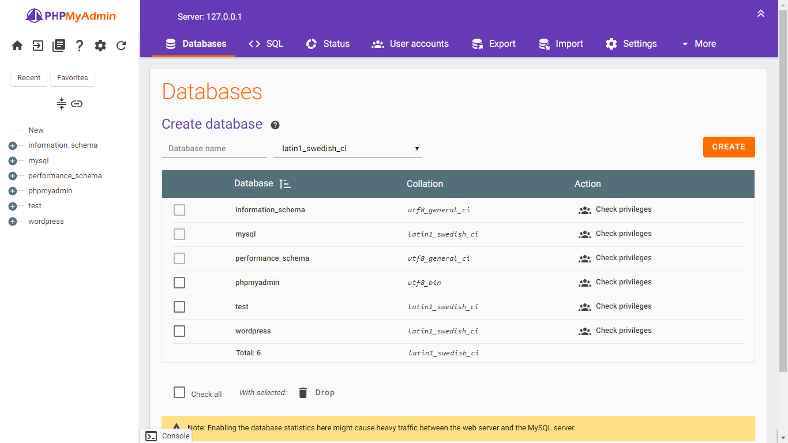
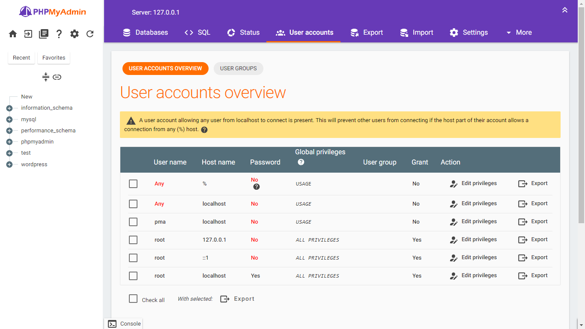
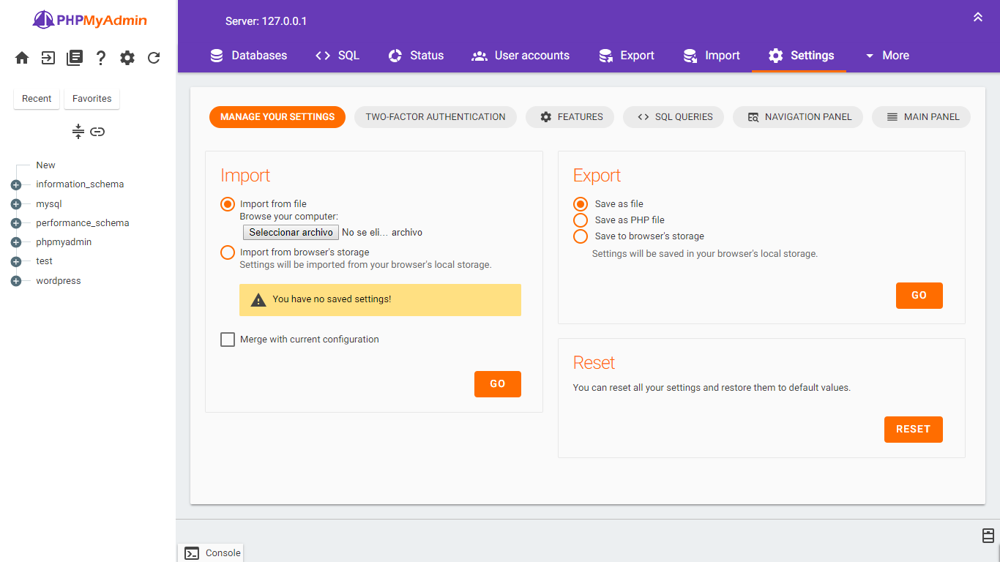

# Material v0.2 (Work in progress)
Theme material design for phpmyadmin inspire per the [design by Agustin](http://www.materialup.com/posts/phpmyadmin-material-design)

## Changelog

1. Bug fixes for non-compatible browsers -webkit on the icons.
2. Finished printview script.
3. Minimal bug fixes.

## Usage

* Download Material.
* Unzip **Material-master**.
* Rename **Material-master** to **Material**.
* Move to your phpMyAdmin themes directory.
* Activate "Material" from phpMyAdmin dashboard.
* Done.

## Screenshot

## LICENSE

Licensed under GPL license. Please see the license file: 
